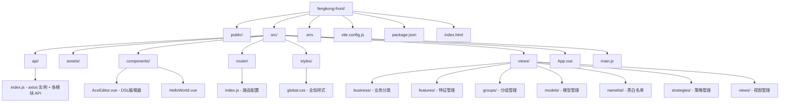

# 🛡️ 风控管理系统前端

> [!summary] 项目概览
> 风控（风险控制）管理系统的前端管理后台，基于 **Vue 3 + Vite** 构建，提供 **策略管理**、**特征管理**、**分组管理**、**名单管理**、**模型管理**、**视图管理** 和 **业务分类管理** 七大核心功能模块。

---

## 📋 目录

- [[#🛡️ 风控管理系统前端|项目首页]]
	- [[#🧰 技术栈]]
	- [[#🧩 功能模块]]
	- [[#📁 项目结构]]
	- [[#🚀 快速开始]]
	- [[#🔌 API 接口说明]]
	- [[#💡 开发说明]]
- [[#✅ Todo|后续任务]]

---

## 🧰 技术栈

> [!info] 核心技术
> 本项目采用 Vue 3 最新生态，构建现代化前端工程

| 分类 | 技术 | 版本 | 说明 |
|:---|:---|:---|:---|
| 🟢 核心框架 | **Vue** | `^3.5.13` | Composition API + `<script setup>` |
| ⚡ 构建工具 | **Vite** | `^6.3.5` | 极速开发构建 |
| 🎨 UI 组件库 | **Ant Design Vue** | `^4.2.6` | 企业级 UI 组件 |
| 🧭 路由 | **Vue Router** | `^4.6.4` | History 模式 |
| 🌐 HTTP 客户端 | **Axios** | `^1.18.1` | 请求拦截 + 统一响应 |
| ✏️ 代码编辑器 | **ace-builds** | `^1.44.0` | DSL 策略编辑器 |
| 🔌 Vite 插件 | **@vitejs/plugin-vue** | `^5.2.3` | Vue SFC 支持 |

---

## 🧩 功能模块

> [!tip] 共 **10** 个子页面，默认首页重定向至 **策略管理**

### 🎯 策略管理
- **路径**: `/strategies`
- **子路由**:
  - `GET /strategies` - 策略列表
  - `GET /strategies/add` - 新增策略
  - `GET /strategies/edit/:name` - 编辑策略
- **功能**: DSL 策略的列表、新增、编辑、删除、编译、测试

### 📊 特征管理
- **路径**: `/features`
- **功能**: 特征列表查询

### 👥 分组管理
- **路径**: `/groups`
- **子路由**:
  - `GET /groups` - 分组列表
  - `GET /groups/add` - 新增分组
  - `GET /groups/edit/:name` - 编辑分组
- **功能**: 分组的增删改查及测试

### 📋 名单管理

> [!example] 黑白名单支持

| 名单类型 | 路径 | 说明 |
|:---|:---|:---|
| ⚫ 黑名单-用户 | `/namelist/black-user` | 黑名单用户增删改查 |
| ⚫ 黑名单-IP | `/namelist/black-ip` | 黑名单 IP 增删改查 |
| ⚫ 黑名单-设备 | `/namelist/black-device` | 黑名单设备增删改查 |
| ⚪ 白名单-用户 | `/namelist/white-user` | 白名单用户增删改查 |

### 🤖 模型管理
- **路径**: `/models`
- **功能**: 模型列表、更新、删除

### 👁️ 视图管理
- **路径**: `/views`
- **功能**: 自视、他视、日志查看与保存

### 🏢 业务分类
- **路径**: `/business`
- **子路由**:
  - `GET /business` - 业务分类列表
  - `GET /business/add` - 新增业务分类
  - `GET /business/edit/:name` - 编辑业务分类
- **功能**: 业务分类 CRUD、绑定/解绑

---

## 📁 项目结构



> [!note] 关键文件说明
> - `src/api/index.js` :: 所有后端接口的统一封装，含请求/响应拦截器
> - `src/router/index.js` :: 路由配置，使用 `createWebHistory` 模式
> - `vite.config.js` :: 开发服务器代理配置
> - `.env` :: 环境变量配置

---

## 🚀 快速开始

### ✅ 环境要求

- [x] Node.js >= **16**
- [x] npm >= **7**

### 📦 安装依赖

```bash
npm install
```

### ⚙️ 环境配置

> [!warning] 必做配置
> 编辑根目录 `.env` 文件，配置后端 API 基础地址：

```env
VITE_API_BASE_URL=http://localhost:7070
```

### 🏃 启动开发服务器

```bash
npm run dev
```

> [!success] 启动成功
> - 访问地址: **http://localhost:3000**

#### 🔀 代理配置

| 前端路径 | 代理目标 | 说明 |
|:---|:---|:---|
| `/thanos-admin` | `http://localhost:7070` | 风控管理后台接口 |
| `/thanos` | `http://localhost:7070` | 风控核心接口 |
| `/gamora` | `http://localhost:7070` | 模型服务接口 |

### 🏗️ 构建生产版本

```bash
npm run build
```

### 👀 预览生产构建

```bash
npm run preview
```

---

## 🔌 API 接口说明

> [!info] 接口统一封装在 `src/api/index.js`

### 📦 API 对象清单

| API 对象 | 模块 | 主要方法 |
|:---|:---|:---|
| `strategyApi` | 策略管理 | `list` `query` `create` `update` `delete` `test` `compile` |
| `featureApi` | 特征管理 | `list` `query` |
| `groupApi` | 分组管理 | `list` `query` `create` `update` `delete` `test` |
| `namelistApi` | 名单管理 | `blackUser*` `blackIp*` `blackDevice*` `whiteUser*` |
| `modelApi` | 模型管理 | `list` `update` `delete` |
| `viewApi` | 视图管理 | `self` `other` `ok` `logs` `logSave` `logQuery` |
| `businessApi` | 业务分类 | `list` `query` `create` `bind` `unbind` `delete` |

### 🛡️ 响应拦截规则

后端统一响应格式：

```json
{
  "code": 200,
  "msg": "success",
  "data": {}
}
```

> [!tip] 状态码处理逻辑
> - ✅ `code === 200` **或** `code === 0` → 请求成功，返回 `data`
> - ⚠️ `code === 9001` → **登录过期**，弹出提示并跳转 `/login`
> - ❌ 其他 code → **业务错误**，弹出 `msg` 错误提示并 reject Promise

> [!danger] 网络错误
> 请求异常时统一提示：**"网络请求失败"**

---

## 💡 开发说明

> [!note] 开发约定

- 🏠 **默认首页**：`/` 自动重定向至 `/strategies`（策略管理页面）
- 🧭 **路由模式**：使用 Vue Router 的 `createWebHistory` 模式（HTML5 History）
- ⏱️ **请求超时**：HTTP 请求默认 **10 秒** 超时
- 🍪 **凭证携带**：`withCredentials: true`，跨域请求携带 Cookie

---

## ✅ Todo

> [!todo] 后续可完善
> - [ ] 补充项目截图展示
> - [ ] 添加 Nginx 部署配置示例
> - [ ] 补充后端服务仓库链接
> - [ ] 添加单元测试说明
> - [ ] 补充代码规范与提交流程

---

## 📄 License

> [!example] 
> **Private** - 私有项目
