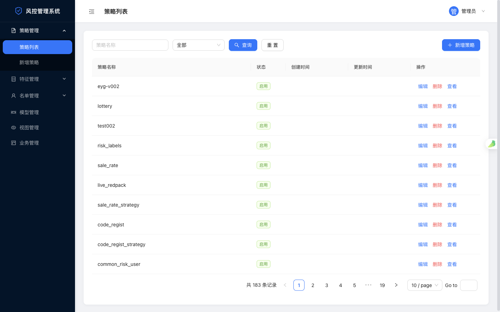
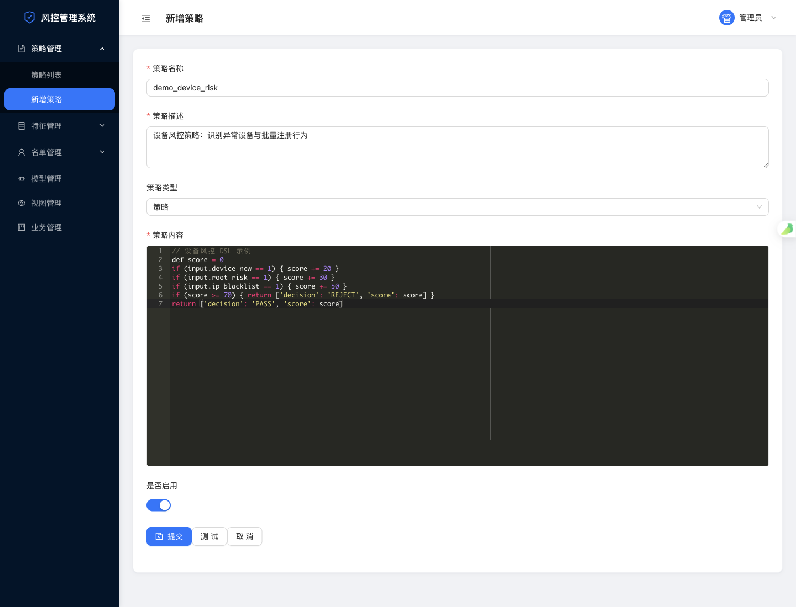
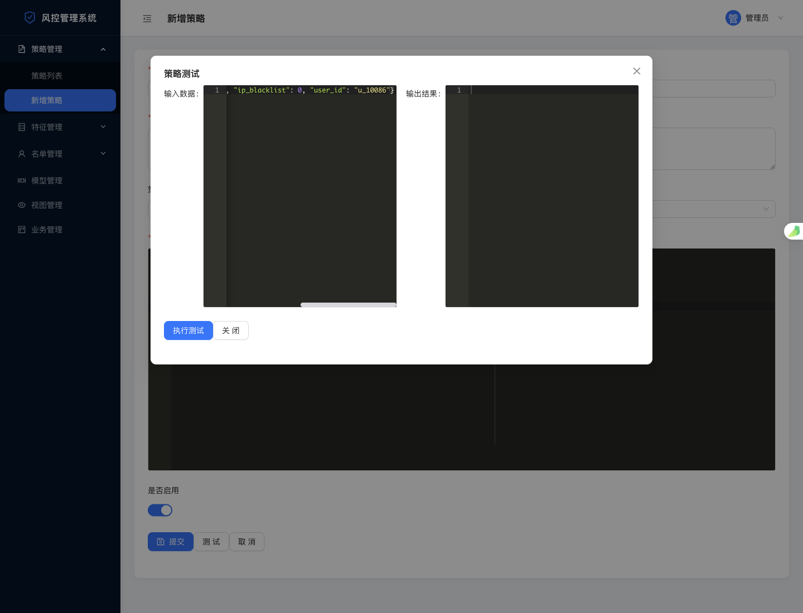
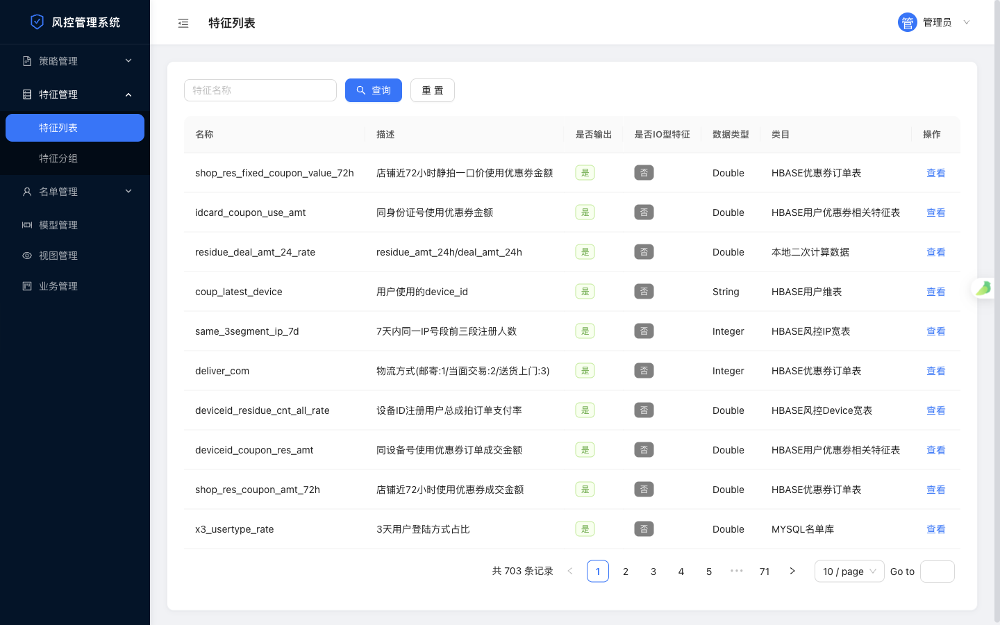
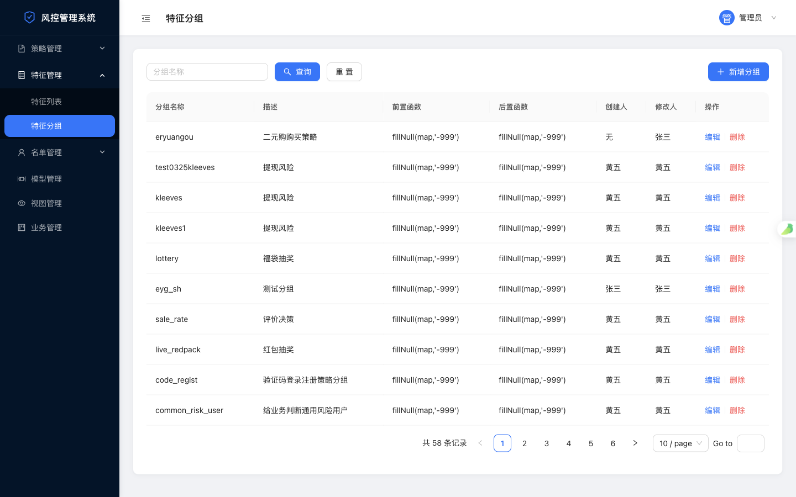
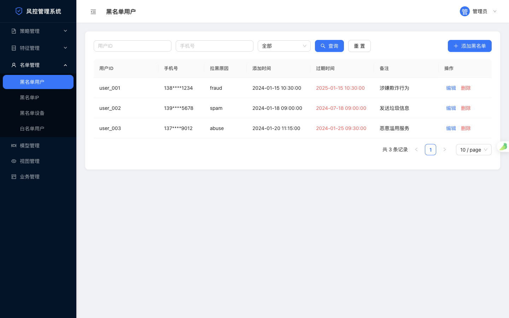
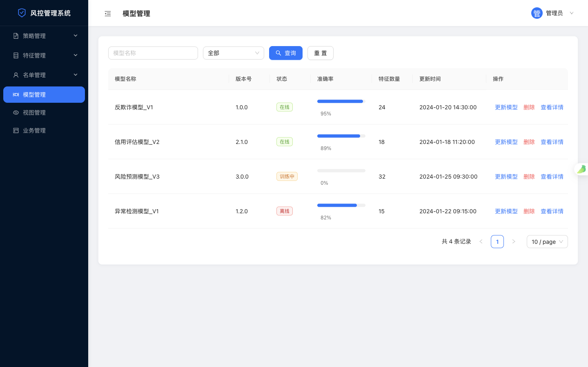
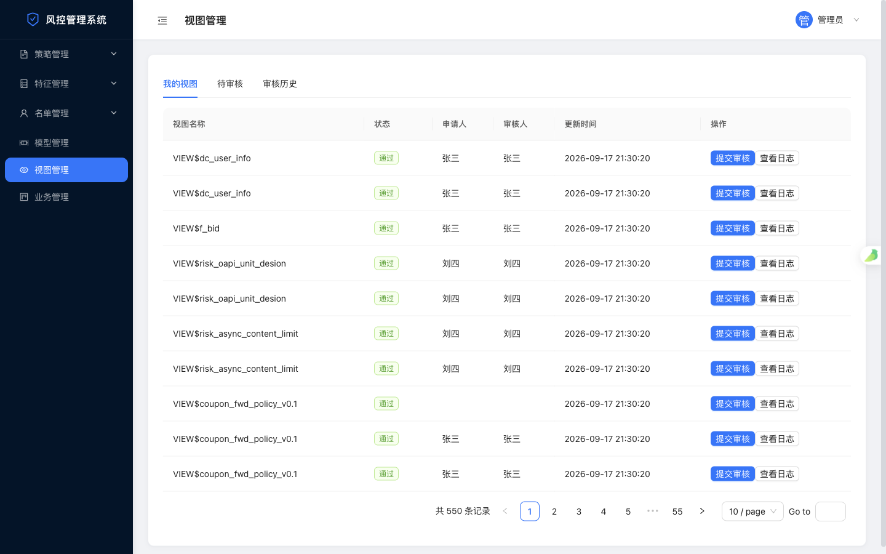
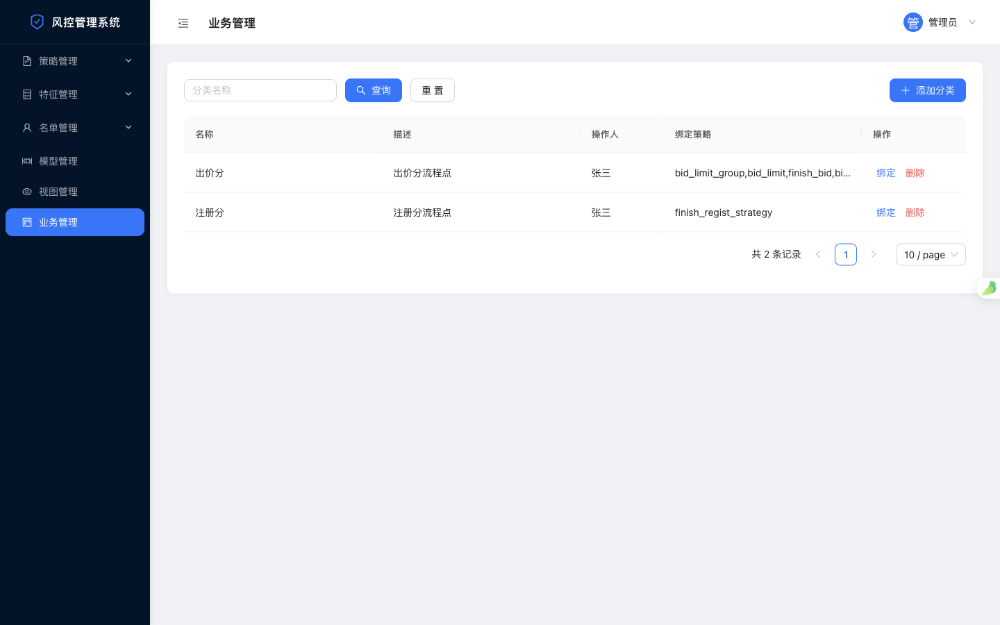

# 风控管理系统前端 · risk-control-front

> 一个面向风控业务的企业级后台管理系统前端，基于 **Vue 3 + Vite + Ant Design Vue** 构建，覆盖策略、特征、名单、模型、视图、业务分类六大风控核心域，内置 **DSL 策略在线编辑器** 与 **策略在线测试（编译 / 执行）** 能力。

   

---

## 一、项目简介

本项目是「风控管理平台」的前端管理后台，面向风控策略 / 运营人员，提供一套可视化、可配置的风控能力管理界面：

- **策略即 DSL**：策略以 Groovy 风格 DSL 文本组织，通过**内嵌代码编辑器**编写，并支持**在线编译与实时测试**；
- **特征 → 分组 → 策略**的三层风控编排模型：特征可被分组引用，分组承载前置 / 后置预处理函数，策略再消费分组；
- **黑白名单**：支持用户 / IP / 设备三个维度的黑名单，以及用户白名单；
- **模型 & 视图治理**：模型版本 / 状态 / 准确率管理，视图（数据权限）走「申请 → 提交 → 审核」工作流；
- **业务分类**：将策略按业务域（如出价分、注册分）进行归类与绑定。

| 维度 | 说明 |
|:---|:---|
| **项目类型** | 个人项目 · 风控中台前端 |
| **角色定位** | 前端架构与全量页面实现 |
| **代码规模** | 7 大功能模块、17+ 前端路由页面、20+ Vue SFC 组件 |
| **数据规模** | 线上运行管理 **180+ 条风控策略**、海量特征 / 分组 / 名单数据 |
| **后端依赖** | 独立 Java 服务（`localhost:7070`），前端通过 Vite 代理对接 `/thanos-admin`、`/thanos`、`/gamora` 三类接口 |

---

## 二、界面总览



*图 1 · 系统首页（策略列表）——暗色侧边导航 + 白色卡片内容区，统一搜索栏 + 表格 + 分页的经典后台骨架。*

---

## 三、技术栈

| 分类 | 技术 | 版本 | 用途 |
|:---|:---|:---|:---|
| 🟢 核心框架 | **Vue 3** | `^3.5` | Composition API + `<script setup>` |
| ⚡ 构建工具 | **Vite** | `^6.3` | 开发服务器 + 生产构建 + 接口代理 |
| 🎨 UI 组件库 | **Ant Design Vue** | `^4.2` | 企业级组件（表格 / 表单 / 弹窗 / 菜单） |
| 🧭 路由 | **Vue Router** | `^4.6` | History 模式 + 路由懒加载 + 嵌套导航 |
| 🌐 HTTP 客户端 | **Axios** | `^1.18` | 请求 / 响应拦截器 + 统一响应规范 |
| ✏️ 代码编辑器 | **ace-builds** | `^1.44` | DSL 策略编辑器（Java / JSON 语法高亮） |
| 🔌 插件 | **@vitejs/plugin-vue** | `^5.2` | Vue SFC 编译 |

---

## 四、功能模块

### 4.1 策略管理（核心模块）

风控策略的全生命周期管理：**列表 / 新增 / 编辑 / 删除 / 详情 / 在线测试**。

- 策略类型覆盖：策略、流程、模型、调度、规则五类；
- 策略内容以 **DSL 文本** 组织，通过 Ace 编辑器编写（Java 语法高亮 + monokai 主题）；
- 支持**在线测试**：左侧输入 JSON 测试数据，右侧实时返回执行结果。

<table>
  <tr>
    <td width="50%"></td>
    <td width="50%"></td>
  </tr>
  <tr>
    <td align="center"><em>图 2 · 新增策略 —— DSL 代码编辑器</em></td>
    <td align="center"><em>图 3 · 策略在线测试 —— 输入 / 输出双栏 JSON</em></td>
  </tr>
</table>

### 4.2 特征管理

特征与特征分组的统一管理：

- **特征列表**：展示特征的名称、描述、是否输出、是否 IO 型特征、数据类型、类目；
- **特征分组**：将特征按业务聚合，分组可配置**前置函数 / 后置函数**（预处理逻辑）；
- 分组新增时支持**特征多选 + 模糊搜索（防抖）+ 在线测试**。

<table>
  <tr>
    <td width="50%"></td>
    <td width="50%"></td>
  </tr>
  <tr>
    <td align="center"><em>图 4 · 特征列表</em></td>
    <td align="center"><em>图 5 · 特征分组</em></td>
  </tr>
</table>

### 4.3 名单管理

黑白名单的增删改查，覆盖四个维度：

| 名单类型 | 路径 | 说明 |
|:---|:---|:---|
| ⚫ 黑名单 - 用户 | `/namelist/black-user` | 用户 ID / 手机号 / 拉黑原因 / 过期时间 |
| ⚫ 黑名单 - IP | `/namelist/black-ip` | 拉黑 IP 段 |
| ⚫ 黑名单 - 设备 | `/namelist/black-device` | 拉黑设备指纹 |
| ⚪ 白名单 - 用户 | `/namelist/white-user` | 白名单用户 |

> **业务细节**：过期时间自动高亮（已过期标记红色），拉黑原因字典化展示。



*图 6 · 黑名单用户管理*

### 4.4 模型管理

风控模型的版本 / 状态 / 准确率管理：

- 状态标签（在线 / 离线 / 训练中）按语义着色；
- **准确率进度条**可视化展示模型效果；
- 支持模型更新（触发重训）、删除、详情查看。



*图 7 · 模型管理 —— 状态标签 + 准确率进度条*

### 4.5 视图管理（审核工作流）

数据视图（权限）的治理，实现**「申请 → 提交 → 审核」**闭环：

- 三个 Tab 分区：**我的视图 / 待审核 / 审核历史**；
- 待审核视图支持「审核通过」；
- 每个视图可查看**操作日志**（创建 / 提交 / 审核全链路留痕）。



*图 8 · 视图管理 —— 审核工作流*

### 4.6 业务分类管理

将分散的策略按业务域进行分类与绑定：

- 分类的新增 / 删除；
- **策略绑定 / 解绑**：一个分类可绑定多条策略（逗号分隔）。



*图 9 · 业务分类管理 —— 分类 + 策略绑定*

---

## 五、技术亮点（可直接用于简历）

### 架构与工程化

- 🧩 **统一响应协议**：封装 Axios 拦截器，统一处理 `{ code, msg, data }` 响应规范，自动识别登录过期（`code === 9001`）跳转登录、业务错误提示、网络异常兜底，业务层无需重复处理错误；
- 🎨 **Design Token 主题定制**：通过 Ant Design Vue `ConfigProvider` 统一主色、圆角、字体、表格 / 按钮 / 菜单等组件级样式，保证全局视觉一致；
- 🗂 **路由工程化**：Vue Router 懒加载 + 嵌套子菜单，路由与菜单高亮、折叠状态双向同步；
- 🧱 **可复用组件封装**：将 Ace Editor 二次封装为受控组件（`v-model` + Props 透传主题 / 语法 / 高度 / 字号），策略与测试模块复用同一套编辑器能力。

### 业务与交互难点

- ✏️ **DSL 在线编辑与实时测试**：Java / JSON 双语法高亮的代码编辑器落地风控 DSL 编写体验，配套「输入 → 输出」双栏 JSON 在线测试，缩短策略验证链路；
- 🔍 **模糊搜索 + 防抖 + 竞态控制**：特征多选搜索采用 `debounce(300ms)`，并通过自增 `fetchId` 丢弃过期响应，避免高并发下拉时的结果覆盖（`group/add`、`feature` 模块）；
- 📋 **复杂列表状态管理**：策略 / 特征 / 模型 / 名单 / 视图 / 分类六大列表统一「搜索 + 重置 + 分页 + 表格 + 详情弹窗」交互范式，代码高复用；
- ✅ **审核工作流**：视图管理实现三态（待审核 / 通过 / 拒绝）+ 操作日志的完整状态机前端建模。

---

## 六、系统架构

```text
┌──────────────────────────────────────────────────────────┐
│                      浏览器 (SPA)                          │
│   Vue 3 + Vue Router + Ant Design Vue + Axios           │
│                                                          │
│   ├─ 策略管理   (Ace DSL 编辑器 + 在线测试)                │
│   ├─ 特征管理   (特征 / 分组 / 前后置函数)                 │
│   ├─ 名单管理   (黑白名单 4 维度)                          │
│   ├─ 模型管理   (版本 / 状态 / 准确率)                     │
│   ├─ 视图管理   (审核工作流)                              │
│   └─ 业务管理   (分类 + 策略绑定)                         │
└────────────────────────┬─────────────────────────────────┘
                         │  HTTP (JSON, withCredentials)
                         │  Vite proxy: /thanos-admin /thanos /gamora
                         ▼
              ┌───────────────────────────┐
              │   Java 后端服务 (:7070)      │
              │  thanos-admin / thanos     │
              │  / gamora 三组接口           │
              └───────────────────────────┘
```

- **代理转发**：`vite.config.js` 将 `/thanos-admin`、`/thanos`、`/gamora` 转发到 `localhost:7070`，本地开发无跨域问题；
- **认证**：请求携带 `withCredentials`，对接后端登录态。

---

## 七、项目结构

```text
risk-control-front/
├─ src/
│  ├─ api/index.js                 # Axios 封装 + 全部接口定义
│  ├─ components/AceEditor.vue     # DSL 代码编辑器（可复用组件）
│  ├─ router/index.js              # 路由配置（懒加载）
│  ├─ styles/global.css            # 全局样式 + 页面骨架
│  ├─ App.vue                      # 布局（侧边导航 + 顶栏 + 内容区）
│  └─ views/
│     ├─ strategies/               # 策略管理（列表/新增/编辑）
│     ├─ features/                 # 特征列表
│     ├─ groups/                   # 特征分组（列表/新增/编辑）
│     ├─ namelist/                 # 黑白名单（用户/IP/设备/白名单）
│     ├─ models/                   # 模型管理
│     ├─ views/                    # 视图管理（审核工作流）
│     └─ business/                 # 业务分类管理
├─ doc/
│  ├─ README.md                    # 本文档（项目展示说明）
│  └─ images/                      # 界面截图
├─ vite.config.js                  # Vite 构建 + 代理配置
└─ package.json
```

---

## 八、快速开始

```bash
# 安装依赖
npm install

# 启动开发服务（默认 http://localhost:3000）
npm run dev

# 生产构建
npm run build

# 本地预览构建产物
npm run preview
```

> 前置条件：本地需启动后端服务（`localhost:7070`）；前端通过 Vite 代理访问后端接口。

---

## 九、简历展示建议（STAR 提炼）

**项目经历一句话描述**

> 独立开发「风控管理平台」前端管理后台，基于 Vue 3 + Vite + Ant Design Vue 实现策略 / 特征 / 名单 / 模型 / 视图 / 业务六大模块，内置 DSL 策略在线编辑器与策略在线测试，支撑 180+ 条风控策略的可视化配置与管理。

**可迁移的技术要点（面试展开）**

| 考察点 | 对应实现 |
|:---|:---|
| 代码编辑器集成 | 封装 Ace Editor 组件，支持多语法高亮 + 主题 / 高度定制，落地风控 DSL 编写与在线测试 |
| 请求层设计 | Axios 拦截器统一响应协议、错误处理、登录过期跳转 |
| 交互性能优化 | 特征搜索防抖 + 请求竞态控制（fetchId 丢弃过期响应） |
| UI 一致性 | Ant Design Vue Design Token 主题定制 + 统一页面骨架 |
| 复杂状态建模 | 视图审核三态状态机 + 操作日志全链路留痕 |
| 工程化 | 路由懒加载、组件化拆分、Vite 代理多后端对接 |

---

## 十、待完善方向

- [ ] 模型管理、名单管理接口后端尚未全部就绪，前端已预留交互（当前以 Mock 数据演示）；
- [ ] 名单编辑功能待完善；
- [ ] 可接入权限路由（按钮级权限）与更多数据可视化看板。